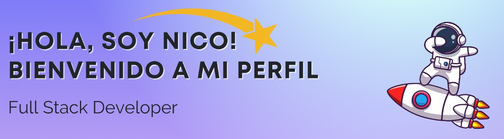
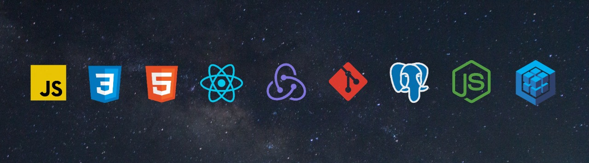

<h1 >¿Quién soy?</h1>

Soy desarrolador full stack graduado en el bootcamp de soyHenry. Desde chico me apasiona la tecnologia y todo lo que tenga que ver con la computacion. Detallista y exigente en los trabajos o proyectos en los que participo. Me siento muy comodo trabajando en grupo, me adapto a todo tipo de ambiente y me gusta colaborar con los demas y tambien pedir ayuda si la necesito. Siempre estoy predispuesto al aprendizaje continuo.

<h1 >¿Que tecnologias domino?</h1>

Html5 - Css3 - JavaScript
React - Redux - ChakraUI - Bootstrap
NodeJS - Express - Sequelize - PostgreSQL
Scrum - Git - GitHub - GitFlow
UML - Modelado de Sistemas de Software 
CorelDRAW - Photoshop - Illustrator

<h1 >¿Qué objetivos y proyectos tengo?</h1>

Mi principal meta es poder conseguir un empleo de programador de forma remota, aunque si se abren nuevos horizontes en algún otro lugar, estoy totalmente abierto a nuevos cambios. Tengo una personalidad inquieta que me lleva a estar en constante aprendizaje. Por lo que busco siempre tener un nivel de conocimientos cada vez mayor para poder conseguir el empleo que tanto deseo.

 

